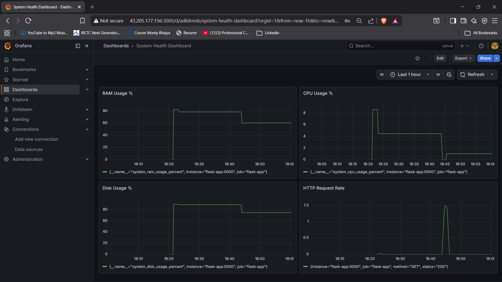

# Flask Monitoring Stack
A containerized REST API with a full observability stack — deployed on AWS EC2.

## Tech Stack
- Python Flask - REST API
- Docker & Docker Compose - Containerization
- Prometheus - Metrics collection
- Grafana - Metrics visualization
- AWS EC2 - Cloud deployment (Mumbai region)

## Live Deployment
This stack is deployed on AWS EC2 (Ubuntu, Mumbai region).
- Flask API: http://65.2.9.185:5000/health
- Prometheus: http://65.2.9.185:9090
- Grafana: http://65.2.9.185:3000

## Features
- REST API with /health and /data endpoints
- Real-time request monitoring
- Grafana dashboard showing request rates and status codes
- Fully containerized with Docker Compose
- Cloud deployed on AWS Free Tier

## How to Run Locally
```bash
docker-compose up --build
```
Then visit:
- Flask API: http://localhost:5000/health
- Prometheus: http://localhost:9090
- Grafana: http://localhost:3000

## Architecture
Flask App → Prometheus (scrapes metrics every 15s) → Grafana (visualizes data)
Deployed on AWS EC2 t3.micro instance (Ubuntu 24.04)

## Live Dashboard Screenshot


